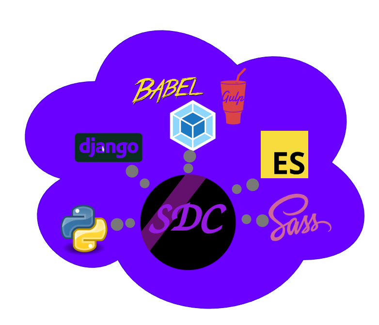

.. ChemotionAPI documentation master file, created by
   sphinx-quickstart on Mon Jun 12 12:14:22 2023.
   You can adapt this file completely to your liking, but it should at least
   contain the root `toctree` directive.

Welcome to Simple-Dom-Control`s documentation!
==============================================

.. toctree::
   :maxdepth: 2

   Introduction
   Install
   getting_started
   library
   navigation
   core
   sdc_controller
   sdc_model
   client

Indices and tables
==================

* :ref:`genindex`
* :ref:`modindex`
* :ref:`search`
