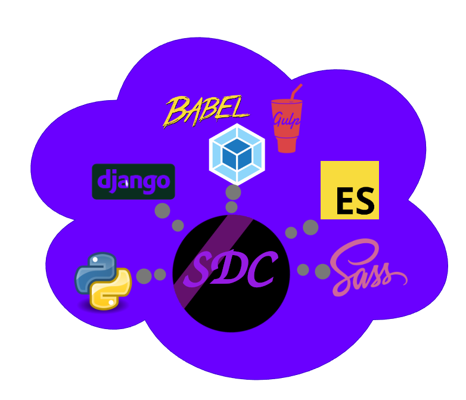

Simple-Dom-Control Documentation
================================

Simple-Dom-Control, usually shortened to ``SDC``, is a Django-centered framework
for building server-rendered applications with a structured client runtime.
It combines:

- Django views and templates for server-side HTML generation
- JavaScript controllers for client-side behavior and DOM orchestration
- model synchronization over WebSockets
- CLI tooling that generates controllers, models, and project scaffolding

This documentation now covers both parts of the system:

- the Python/Django package ``simpledomcontrol``
- the JavaScript runtime ``SimpleDomControlClient``

.. toctree::
   :maxdepth: 2
   :caption: Guides

   Introduction
   Install
   getting_started
   core
   library
   navigation

.. toctree::
   :maxdepth: 2
   :caption: Runtime and API

   client
   sdc_controller
   sdc_model

Indices and tables
==================

* :ref:`genindex`
* :ref:`modindex`
* :ref:`search`
