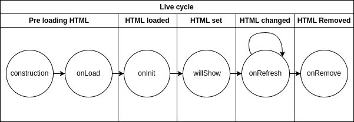

.. _sdc-controller-label:

SDC controller
==============

One of the nice features of SDC is that you can use server rendering methods in combination with agile clients. To have the best of both worlds, SDC uses self-contained controller instances. Such a controller consists of two parts, a client and a server. It is preceded by a short chapter on how to create a controller.
This is followed by a paragraph on how to understand the
server code is to be understood. This is followed by a brief
overview of the client code (HTML, SCSS, JavaScript)

.. _new-controller-controller:

New controller
--------------

We recommend delegating the creation of controllers to the provided scripts designed for this purpose.
To initiate the creation of a new controller, execute the following command within the project directory:

.. code-block:: sh

    $ python manage.py sdc_cc

To complete the process, respond to two prompts in the terminal. First, specify the Django app
in which the controller should be created (e.g., *mypage*). Second, provide a name for the new controller
(for example, *about_me*). It's important to note that only snake case should be used for the controller name.
For additional details, refer to :ref:`sdc-cc-core`.

Alternatively, you can skip the prompts using the following command:

.. code-block:: sh

    $ python manage.py sdc_cc -a <django_app_name> -c <sdc_controller_name>

However, the *sdc_controller_name* must be specified in **snake_case**. If the Django app is not listed in the installed_apps in the django settings, the provided parameter will be ignored.

Server part
-----------

A controller on the client side usually consists of three files: an HTML template file, an SCSS style file, and a JavaScript code file.
The JavaScript code contains the controller class with a *contentUrl* property, pointing to an entry point registered in the *sdc_url.py*
file. This file is automatically generated when the first controller in the corresponding Django app is created. The registered URL then
calls a Python ViewClass, which extends *sdc_core.sdc_extensions.views.SDCView*—closely related to the *django.views.View* class. In
addition to the standard handlers like get, post, put, etc., it also has the *get_content* handler, which is called only to render and serve the controller's template.

For example, assuming we have a Django project called *mysite* with an app called *myapp*:

.. code-block:: python

    ...
    urlpatterns = [
        # scd view below
        ...
        path('main_view', sdc_views.MainView.as_view(), name='scd_view_main_view'),
        ...
    ]
    ...

*./mysite/myapp/sdc_urls.py*

.. code-block:: python

    ...
    class MainView(SDCView):
        template_name='main_test/sdc/main_view.html'

        def get_content(self, request, *args, **kwargs):
            """
            Handle the content retrieval for the controller.

            Parameters:
                - request (HttpRequest): The request object.
                - args (list): Additional positional arguments.
                - kwargs (dict): Additional keyword arguments.

            Returns:
                HttpResponse: The HTML content to be rendered.

            Raises:
                Exception: Raise an exception if an error occurs during content retrieval.
            """
            try:
                # Your Django-specific logic and interactions can be added here within the get_content method.
                return render(request, self.template_name)
            except Exception as e:
                # Handle exceptions gracefully, raising an exception for unexpected errors.
                raise Exception(f"Error retrieving content: {e}")
    ...

*./mysite/myapp/sdc_views.py*

.. code-block:: js

    ...
    class MainViewController extends AbstractSDC {

        constructor() {
            super();
            this.contentUrl = "/sdc_view/main_test/main_view"; //<main-view></main-view>

    ...

*./Assets/src/myapp/controller/main_view/main_view.js*

In the *get_content* method, you have access to the full potential of Django.
However, you must respond with HTML content or otherwise throw an exception.

Other special features compared to handling with Djnago are premissions and redirection, both of which are described in the following section: "Error handling and Permissions".
Yet we need to introduce on farther case here in this section: *How to parameterize a query*.

In order to use the development in a meaningful way, it must be possible to parameterize queries. Since it is often necessary to parameterize a query, SDC adds another Django command. This can be achieved by adding URL parameters to sdc_urls.py:

.. code-block:: python

    ...
    urlpatterns = [
        # scd view below
        ...
        path('main_view/<int:pk>', sdc_views.MainView.as_view(), name='scd_view_main_view'),
        ...
    ]
    ...

*./mysite/myapp/sdc_urls.py*

After running:

.. code-block:: sh

    $ python manage.py sdc_update_urls

The client will automatically update its contentUrl property:

.. code-block:: js

    ...
    class MainViewController extends AbstractSDC {

        constructor() {
            super();
            this.contentUrl = "/sdc_view/main_test/main_view/%(pk)s"; //<main-view data-pk=""></main-view>

*./Assets/src/myapp/controller/main_view/main_view.js*

The Client
----------

When we talk about the client in this section, we mean the ECMAScript (JavaScript) controller class, a template HTML file and a Style SCSS file.
These files are placed in a Assets folder which lies in the Django app directory. This directory is linked in the global Assets directory.sdc_extensions

Linked directory: *./Assets/src/<APP>* refers to ./<APP>/Assets/src

.. list-table:: Client Files
   :widths: 30 30 40
   :header-rows: 1

   * - Type
     - Filetype
     - File
   * - Style
     - .scss
     - *./Assets/src/<APP>/controller/<CONTROLLER>/<CONTROLLER>.scss*
   * - ECMAScript
     - .js
     - *./Assets/src/<APP>/controller/<CONTROLLER>/<CONTROLLER>.js*
   * - Template
     - .html
     - *./Assets/src/<APP>/controller/<CONTROLLER>/<CONTROLLER>.html*

Style
+++++

The scss file is imported in the apps *./Assets/src/<APP>/<APP>.style.scss* which then is imported in the global style file *./Assets/src/index.style.scss*.
It has to be manged that you can add global styling rules to both files: ./Assets/src/<APP>/<APP>.style.scss* and *./Assets/src/index.style.scss* without
interfering with the SDC  philosophy. The actual *./Assets/src/<APP>/controller/<CONTROLLER>/<CONTROLLER>.scss* effects all HTML within a controller.
If you leave it empty it will be ignored. Hence, you dont need to delete it. Following an example for the *MainView* controller:

.. code-block:: css

    [main-view] {
        /* <- Your code goes here! */
    }

*./Assets/src/myapp/controller/main_view/main_view.scss*

Template
++++++++

The template file is a basic HTML file, rendered by the *get_content* method of the Python View Class. By default,
SDC utilizes Django’s built-in rendering engine (see `Django Tutorial <https://docs.djangoproject.com/en/5.0/intro/tutorial03/>`_).
However, you have the flexibility to use other rendering engines
if you prefer. Please bear in mind that the controller generating command, *sdc_cc*, always generates an HTML file and employs
Django’s built-in render function.

ECMAScript Controller
+++++++++++++++++++++

The ECMAScript controller is a class that extends sdc_client.AbstractSDC. It is the centrepiece of the client and connects all other elements
It is responsible for:

* The client lifecycle.
* Events (both DOM events and SDC events)
* Collecting arguments
* Model management (see :ref:`sdc-model-label`)
* Server communication
* Registering the html TAG

Live cycle
__________

The life cycle consists of 5 steps. Each step has a responsible processor, see Figure 1:

  **Figure 1:** Live cycle of a SDC controller.

Redirect, Error handling and Permissions
++++++++++++++++++++++++++++++++++++++++

Redirects, errors, and permissions have been carefully addressed in the system. A built-in method facilitates client redirection, while errors can be efficiently handled through error raising.

Permissions are managed through abstracted classes (mixins) within the views, ensuring a structured and secure approach to access control.

Redirect
________

A redirect can be simplly triggered from the server side by returning *sdc_core.sdc_extensions.response.send_redirect*.

.. automodule:: sdc_core.sdc_extentions.response
   :members: send_redirect

.. code-block:: python

    from sdc_core.sdc_extensions.response import send_redirect
    ...
    class MainView(SDCView):
        template_name='main_test/sdc/main_view.html'

        def get_content(self, request, *args, **kwargs):
            """
            Handle the content retrieval for the controller.

            Parameters:
                - request (HttpRequest): The request object.
                - args (list): Additional positional arguments.
                - kwargs (dict): Additional keyword arguments.

            Returns:
                HttpResponse: Redirect to the controller: 'second-view'

            Raises:
                Exception: Raise an exception if an error occurs during content retrieval.
            """
            return send_redirect('second-view')
    ...

*./mysite/myapp/sdc_views.py*

.. code-block:: js

    ...
    class MainViewController extends AbstractSDC {

        constructor() {
            super();
            this.contentUrl = "/sdc_view/main_test/main_view"; //<main-view></main-view>

    ...

*./Assets/src/myapp/controller/main_view/main_view.js*